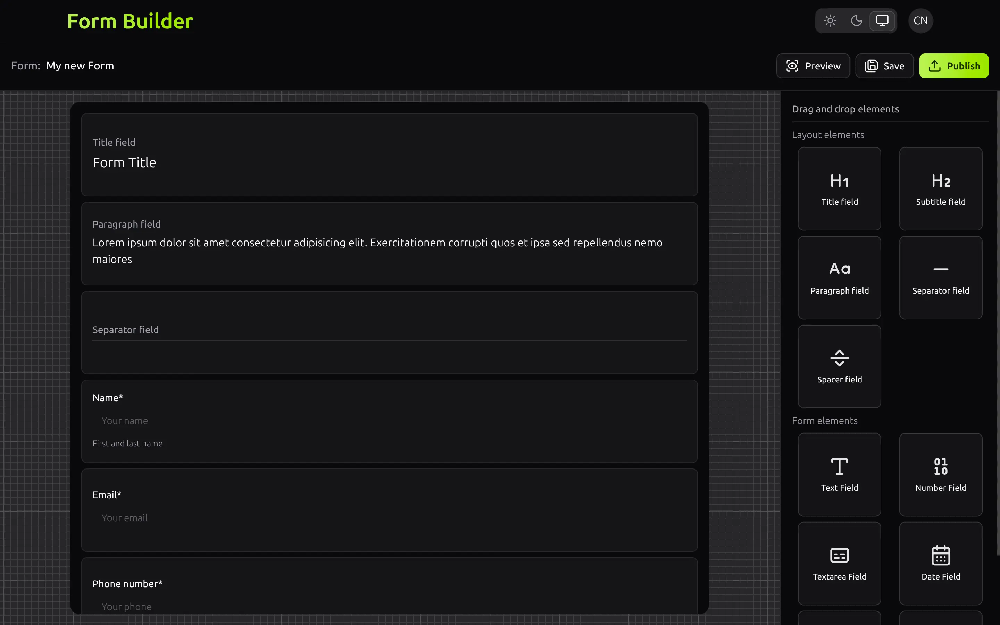
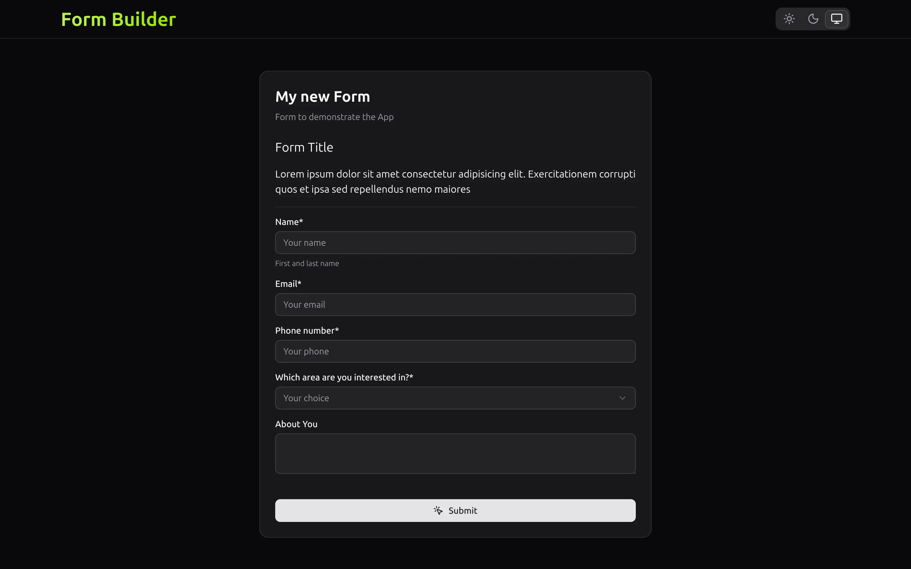

# Form Builder

Form Builder is a web application that allows users to create and manage forms. It provides a user-friendly interface for designing and customizing forms, as well as features for managing form submissions and analyzing form data.




## 🔑 Key Features

- Design and customize forms using a drag-and-drop interface.
- Add various form elements such as text fields, checkboxes, radio buttons, and more.
- Set validation rules for form fields.
- Preview and test forms before publishing.
- Manage form submissions and view analytics.

## 📋 Requirements

Before running this project, ensure you have the following installed on your system:

### Database Configuration

This project is configured to use **PostgreSQL** as the database, you can use the `docker-compose.yml` file provided in the project for easy database setup:

```bash
docker compose up -d
```

**The database will be available at:**

- Host: `localhost`
- Port: `5432`
- Database: `formbuilder`
- Username: `formbuilder`
- Password: `formbuilder`

## 🛠️ Installation & Setup

**1. Clone the Repository**

```bash
git clone https://github.com/IgoCarvalho/form-builder.git
cd form-builder
```

**2. Install Dependencies**

```bash
# Using PNPM (recommended)
pnpm install

# Using Yarn
yarn install

# Using NPM
npm install
```

**3. Create a `.env` file based on `.env.example`**

```bash
cp .env.example .env
```

**4. Run Database Migrations**

```bash
npx prisma migrate dev
```

**5. Run the Application**

```bash
npm run dev
```

🎉 **The applications will be available at**: http://localhost:3000

---

<p align="center">
  Made with 💜 by <a href="https://github.com/IgoCarvalho">Igo Carvalho</a>
</p>
